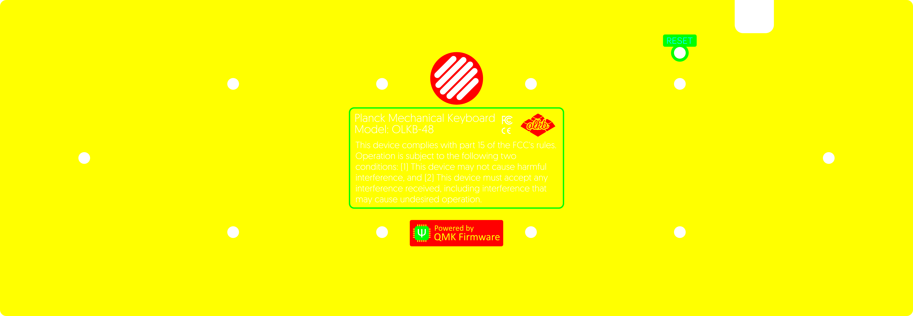

# CMSO PNG conversion

The CMSO system maps the RGBA channels of a PNG (of any DPI, but usually 1200) to the **C**opper, Solder**m**ask, **S**ilkscreen, and **O**utline of a PCB, mainly used for artwork. This works in the following way:

```
Red channel:
  No copper    Copper
  |0%-----------100%|
Green channel:
  No mask        Mask
  |0%-----------100%|
Blue channel:
  No silk        Silk
  |0%-----------100%|
Alpha channel:
  No Board      Board
  |0%-----------100%|
```

The percentages here are a little misleading - values are rounded to off/on during the conversion. 0-126 become 0 and 127-255 become 255. 

Here's three example images and renders of what the PCBs would look like with a matte black soldermask:

|  |  |  |
| ------------- | ------------- | ----- |
|  |  |  |


